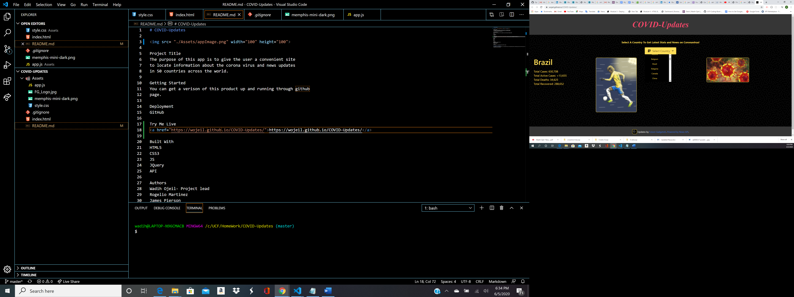

# COVID-Updates

Project Title
The purpose of this app is to give the user a convenient site
to locate information about the corona virus and news updates
in 50 countries across the world.

Getting Started
You can get a verison of this product up and running through github
page.

Deployment
GitHub

Try Me Live
<a href="https://wojeil.github.io/COVID-Updates/">https://wojeil.github.io/COVID-Updates/</a>

Built With
HTML5
CSS3
JS
JQuery
API

Authors
Wadih Ojeil- Project lead
Rogelio Martinez
James Pierson

License
This project is licensed under the MIT License

## Purpose and Inspiration
The purpose of this application is to provide the user with significant data referencing covid 19 stats and new from approximately 50 countries across the world.

